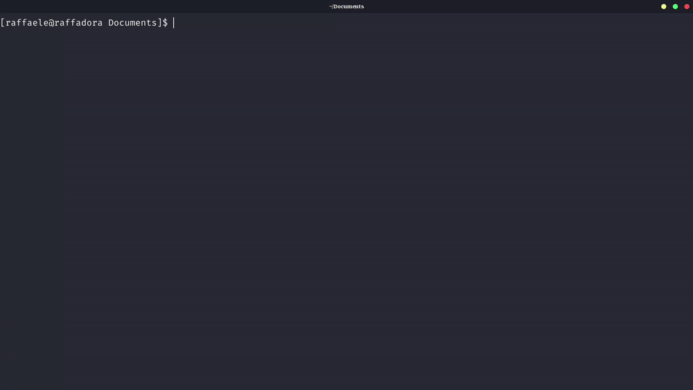

# visistata

Use [VisiData](https://www.visidata.org/) with [Stata](https://www.stata.com).

Allows you to see the dataset using VisiData from Stata console, instead of the `view` command which does not work in the console.

# Installation

Run `install.sh`

# Usage

Call `visi` to open the entire dataset, or `visi, nrows(N)` to see only the first `N` rows (in case the dataset is too large and opening it would be too slow).

